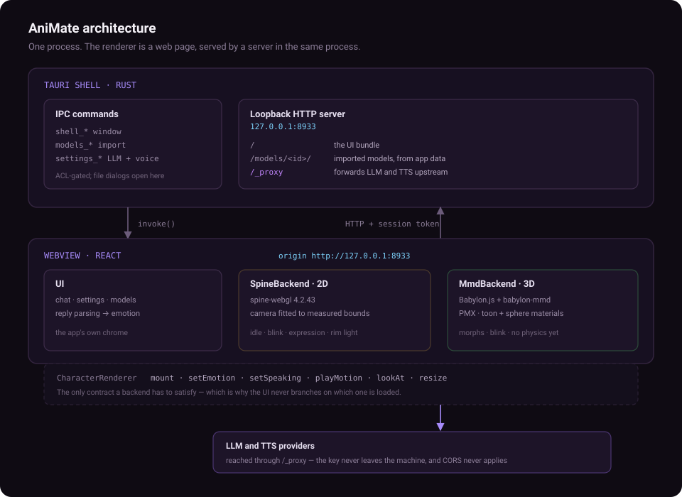

<div align="center">

# AniMate

**A desktop AI companion that actually lives on your desktop.**

Talk to a character that reacts. Bring your own model — 2D or 3D.

[Architecture](#architecture) · [Quick start](#quick-start) · [Importing a character](#importing-a-character) · [Current limitations](#current-limitations)

</div>

---

## What it is

AniMate is a desktop app with a character on the stage and a chat box under it.
You type; the character replies out loud, changes expression, and reacts to what
you said. The model is yours — you import it.

It is **not** a chat wrapper with a picture. The character is a real renderer
with its own animation state, and the reply drives it: the emotion in the
response picks the expression, and speech drives the mouth.

<table>
<tr>
<td width="50%" valign="top">

**Two runtimes, one contract**

`SpineBackend` for 2D skinned meshes, `MmdBackend` for 3D PMX models. Both
implement a single `CharacterRenderer` interface, so the UI never branches on
which one is loaded.

</td>
<td width="50%" valign="top">

**Bring your own everything**

No character ships with the app. No API key ships with the app. You import a
model and paste in an endpoint — that is the whole setup.

</td>
</tr>
</table>

## Features

**Character**

- Two runtimes: Spine (2D) and MMD/PMX (3D), behind one interface
- Camera fitted to the model's own measured bounds, so any model frames itself
  without per-model configuration — models differ in scale by orders of magnitude
- Idle animation, blinking, expression changes driven by the reply
- Fullscreen, always-on-top, window geometry remembered across restarts
- Import by file set (Spine) or by folder with structure preserved (MMD)

**Chat**

- Any OpenAI-compatible endpoint — hosted provider or a local router
- Streaming replies, with a tolerant parser that survives truncated tags,
  reasoning blocks and code fences
- Replies carry a machine tag (`[emotion:happy|attitude:agree]`) which is
  stripped before display and drives the character
- Conversation history in the UI

**Voice**

- OpenAI-compatible `/audio/speech`, with its own endpoint and key if you want
  a different provider than the chat one
- Speech drives the character's mouth

**Desktop**

- Frameless window with custom chrome, `F11` fullscreen, `Esc` to leave
- `Ctrl+,` opens settings
- Loopback-only server; no listening socket reachable from the network

## Quick start

**Requirements:** Node 20.19+ (20.x) or Node 22.12+, a Rust toolchain, and on Windows the
WebView2 runtime (preinstalled on Windows 11, a free download on 10).

```bash
git clone https://github.com/Pidhhh/AniMate.git
cd AniMate
npm ci
npm run dev
```

`npm run dev` starts the Vite dev server and launches the Tauri shell against
it, so edits hot-reload. First run compiles Rust and takes a few minutes; after
that it is fast.

On Windows, build the release executable and an unsigned NSIS installer:

```bash
npm run build
```

## Configuration

AniMate ships with **no endpoint and no key**. Open **Settings** (`Ctrl+,`) and
fill in the **LLM** tab. Enter the API base URL, not the full
`/chat/completions` URL; AniMate adds that path when it sends a message.

| Field | Example |
|---|---|
| Base URL | `https://api.openai.com/v1` |
| API key | `sk-…` |
| Model | `provider-model-id` |

The endpoint must support OpenAI-compatible `/chat/completions`. A local router
can work without a key; leave **API key** empty if yours does not need one.

Voice is off by default. To use it, open **Voice**, enable it, and enter a
speech model. The endpoint must support `/audio/speech`. Empty voice endpoint
and key fields reuse the LLM endpoint and key; fill them in to use a different
speech provider. The voice name defaults to `alloy` if left empty.

**Keep your keys private.** Enter them in the app, not in source files or the
README. AniMate saves them as plain text in `<app_data>/settings.json`; anyone
with access to that file can read them. This file is outside the directories
served by the loopback server, but it is not protected by the OS credential
store. Never commit or share it. Revoke a key if it has been exposed.

## Importing a character

**Settings → Models → Import.** Nothing is bundled — the stage stays empty
until you add something.

**Spine (2D)** — choose *Import files* and select all three parts together:

```
character.skel     the skeleton
character.atlas    texture atlas
character.png      the texture page
```

**MMD (3D)** — choose *Import folder* and pick the folder containing the `.pmx`.
Use the folder option, not the file option: a PMX references its textures by
relative path (`tex/Body.png`), and only the folder import preserves that
structure.

```
MyModel/
├── MyModel.pmx
└── tex/
    ├── Body.png
    └── Face.png
```

Imported models are copied into your app data folder, so the originals can be
moved or deleted afterwards.

> **Bring a model you have the right to use.** AniMate does not ship, host or
> endorse any character art. A model you import is your responsibility and stays
> on your machine.

## Architecture



One process. The Rust shell starts an HTTP server on `127.0.0.1:8933` and points
a webview at it — so the UI is a web page, and the server that served it is
right there.

### Why a loopback server instead of Tauri's own protocol

This is the one design decision worth explaining, because it looks like
unnecessary complexity until you hit the reason.

A browser cannot set an `Authorization` header on a raw WebSocket, and the
realtime voice endpoints need exactly that. It also cannot call a third-party
API cross-origin unless that API opts into CORS, which most do not.

Serving the UI from `http://127.0.0.1:8933` makes every one of those calls
**same-origin**. The renderer posts to `/_proxy?u=…`, and Rust — which has no
such restrictions — makes the real request with the header attached.

The cost is that a listening socket needs defending, so it is:

- **Loopback only.** Bound to `127.0.0.1`, never `0.0.0.0`.
- **Host-validated.** A request whose `Host` is not loopback is refused, which
  is what stops DNS rebinding.
- **Token-gated.** A per-run token is injected into the page before any page
  script runs and required on every privileged route. An HTTP client fetching
  the page does not receive it.
- **Target-allowlisted.** `https` goes anywhere; plain `http` only to loopback
  and private addresses. Redirects are not followed, so the check cannot be
  bounced past.
- **Not a secret store.** `settings.json` lives outside every served directory,
  so the API key is not reachable over HTTP.

## Development

```bash
npm run dev            # run with HMR
npm run build          # Windows release binary and NSIS installer
npm run typecheck      # tsc --noEmit
npm test               # frontend unit tests
```

Rust side:

```bash
cd src-tauri
cargo test --lib       # Rust unit tests
cargo build            # debug binary
```

Windows end-to-end harnesses (run from Git Bash after a debug build):

```bash
bash tools/verify.sh        # routes, guards, renderer bridge
bash tools/verify-chat.sh   # full chat chain, no API key needed
bash tools/verify-window.sh # window geometry must not drift
```

The harnesses use temporary app data and log directories, so they do not
replace your saved settings, API key, or window position. They require port
`8933` to be free before starting.

`verify-chat.sh` starts a mock OpenAI-compatible endpoint and has the app send
one canned turn, so the whole chain — proxy, streaming, tag parsing, character
reaction — is exercised without a key or a human at the keyboard.

### Layout

```
src/
├── character/        CharacterRenderer contract + backends
│   ├── spine/        2D, on the vendored spine-webgl runtime
│   └── mmd/          3D, on Babylon.js + babylon-mmd
├── chat/             LLM client, reply protocol, TTS, orchestration
├── library/          model registry + settings
├── bridge/           shell IPC, session token, window chrome
└── components/       UI
src-tauri/src/
├── server/           loopback server: static, proxy, ws-proxy, diag
├── models.rs         model import and registry
├── paths.rs          app data and log locations
├── settings.rs       settings persistence
├── session.rs        the per-run token
└── window_state.rs   geometry that survives a restart
```

## Current limitations

| | Status |
|---|---|
| **MMD physics** | Not implemented. Hair and skirts do not move. Needs a WASM Bullet runtime. |
| **MMD motion (VMD)** | Not implemented. `playMotion()` rejects rather than pretending. |
| **Chat persistence** | Conversations live in memory and are lost on restart. |
| **Gaze and finger drivers** | Accepted by the contract, not applied by either backend. |
| **Lip sync** | The mouth animates during speech, but not from audio amplitude. |
| **Realtime voice** | The `/_ws-proxy` route is built and hardened; no client uses it yet. |
| **macOS / Linux** | Untested. The code is cross-platform; nobody has run it. |
| **Packaging** | Windows NSIS installer builds; signing and auto-update are not implemented. |

## License

[MIT](LICENSE) for AniMate's own source.

Bundled dependencies and ported code have separate terms:

- **The Spine runtime is not MIT.** `public/vendor/spine-webgl.js` is
  Esoteric Software's. Its [full license and copyright notice](public/vendor/Spine-Runtimes-License-Agreement.txt)
  ship with the source and installer. Confirm the applicable integration and
  distribution terms before publishing a build; the MMD backend does not need
  this runtime.
- **Some renderer and chat logic was ported from RyzaChat.** Its provenance is
  documented in [THIRD-PARTY-NOTICES.md](THIRD-PARTY-NOTICES.md), but this
  repository does not document a redistribution grant for those portions.
  Confirm the rights before redistributing that code.
- **No character art is included.** Imported models stay on the user's machine
  and are excluded from this repository.
- **The app icons are Tauri's defaults**, not AniMate artwork.

See [THIRD-PARTY-NOTICES.md](THIRD-PARTY-NOTICES.md) for the full list.

If you want a character, bring one you have the right to use. It stays on your
machine.
